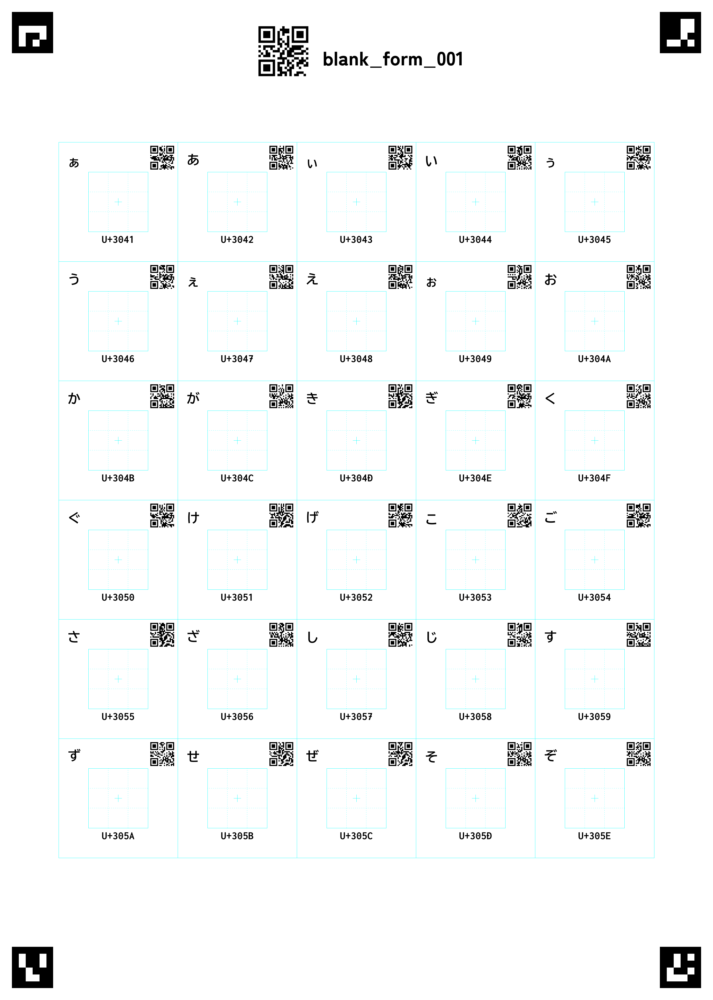

# TegakiFont2SVG

手書きでフォントを作成するためのツール

以下のツールで読み込めるSVGを作成します
UI_FontfフォルダにZenKakuGothicNew-Black.ttfとBizinGothicDiscord-Bold.ttf入れて使ってください

https://github.com/NightFurySL2001/SVG2FontBuilder

※README書き途中です ぼちぼち追加します
